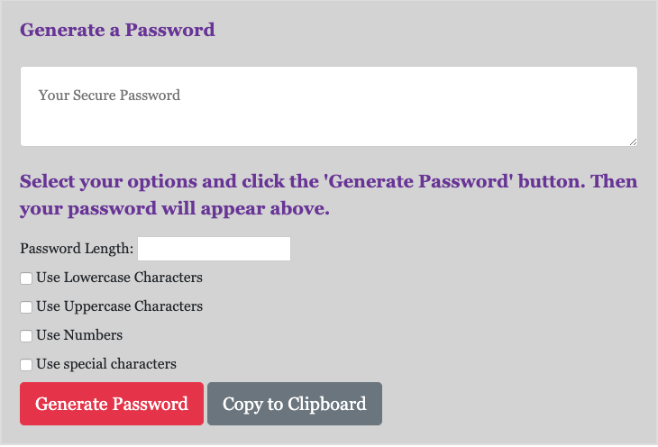
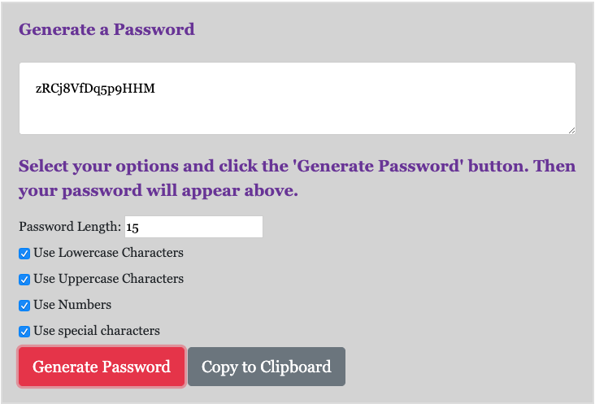

# Password-Generator

A password generator is a tool that automatically generates a password based on user-selected criteriato create strong and unpredictable passwords for your accounts.

## Description

This tutorial will help to create an application that generates a random password based on a user-selected criteria using HTML, CSS, JavaScript, as well as some Bootstrap.

The live version of the website can be viewed at: https://pmscad.github.io/Random-Password-Generator/

## Screenshots

## License

MIT.
